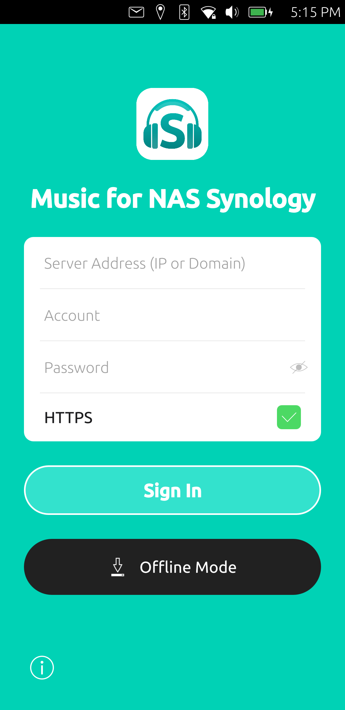
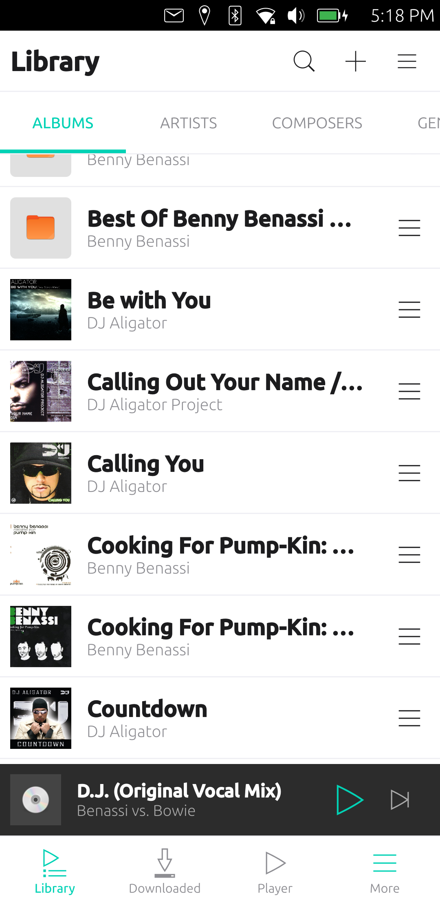
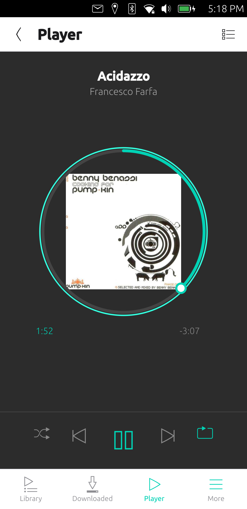
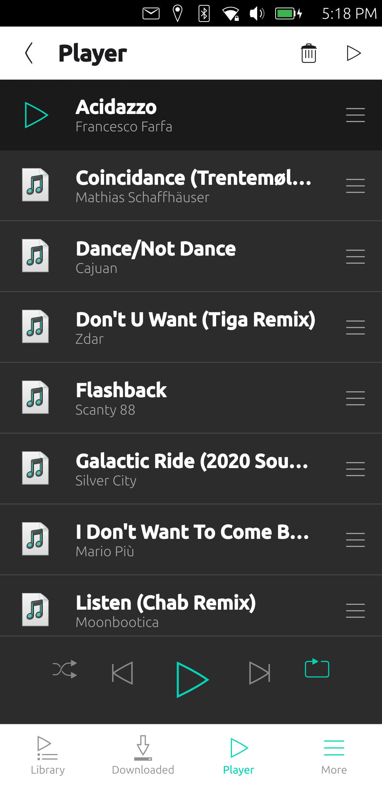
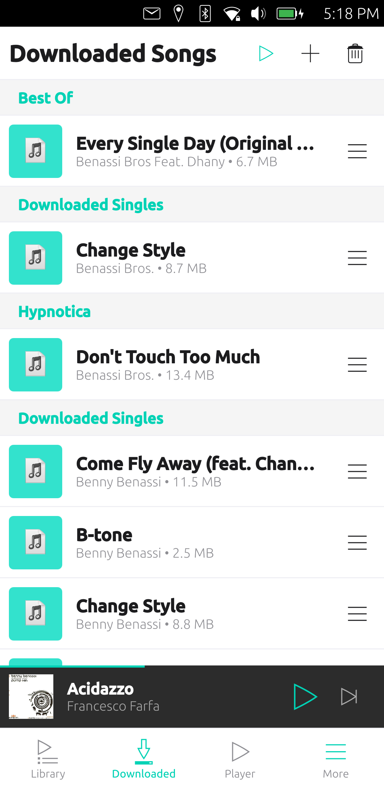
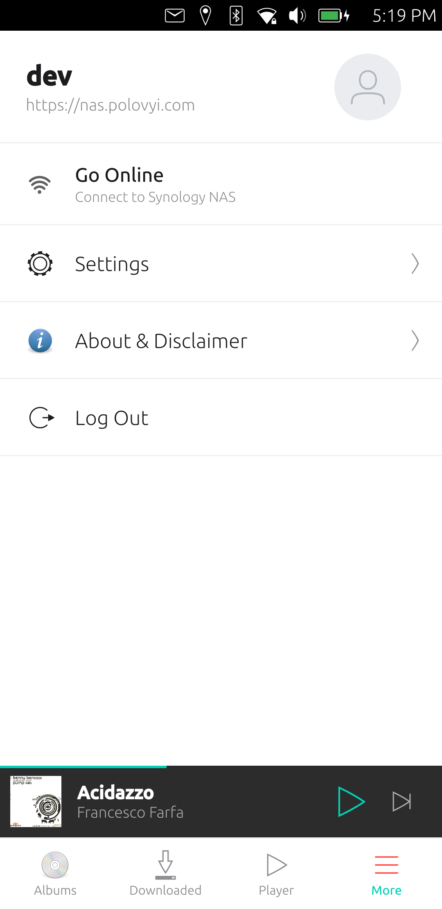

# Music for NAS Synology

[](LICENSE)
[](https://ubuntu-touch.io/)
[](https://clickable-ut.dev/)
[](https://www.paypal.com/donate/?hosted_button_id=2XZA9R384M7R6)

An unofficial, native Ubuntu Touch (Lomiri) application to stream, cache and
play your music from a Synology NAS using the Audio Station API.

> **Disclaimer:** This application has no affiliation or connection with
> Synology Inc. This software is provided "as is" without any warranties, is
> used at your own risk, and we accept no responsibility or liability.

## Features

- **Library Browsing** — albums, artists, composers, genres, folders and all
  songs straight from your Synology NAS
- **Streaming** — full background audio playback (media-hub, sound indicator,
  lock screen controls)
- **Offline Mode** — download songs and listen without a connection
- **Playback Queue** — play next, shuffle, repeat one / repeat all
- **Direct Connection** — the app talks only to your NAS; no intermediate
  servers, your data stays between your device and your NAS
- **Session Handling** — automatic re-login prompt when the session expires,
  retry / offline suggestions when the server is unreachable
- **Privacy** — passwords are never stored on the device

## Screenshots

<p align="center">
  
  
  
</p>
<p align="center">
  
  
  
</p>

## How it's built

The app is an unofficial, community-made clone of Synology's **DS Audio**
mobile client, rebuilt natively for Ubuntu Touch. The UI/UX and the Audio
Station Web API were recreated to preserve the original look and feel.

### AI Development Process

This project is a unique showcase of modern software engineering utilizing
Artificial Intelligence as a core development driver:

- **AI-Driven Engineering** — the application was built heavily through the
  use of AI tools and models to generate QML UI components, Qt bindings, and
  API logic.
- **Visual Modeling & Prompting** — the interface and business logic were
  recreated purely by visually observing the official Synology DS Audio
  application and precisely describing those behaviors and visual aspects via
  text prompts to the AI.
- **No Reverse Engineering** — we did not use decompilation, code scanning,
  cracking, or any other reverse-engineering techniques against the official
  Synology application.
- **Public Open Sources** — all Synology API endpoints (`SYNO.AudioStation.*`,
  `SYNO.API.Auth`) utilized in this project were discovered through public
  internet forums, documentation, and standard diagnostic tools (e.g., browser
  developer tools, curl) used against our own NAS devices.
- **Human Review & Testing** — the AI-generated code underwent strict code
  reviews and was rigorously tested by live human developers on physical
  devices — specifically the Google Pixel 3a and Google Pixel 3a XL running
  the latest version of Ubuntu Touch (Focal).

**Tech stack:**

- **Qt 5.12 / QtQuick 2.9** with the **Ubuntu UI Toolkit** (`Ubuntu.Components 1.3`)
- **QtMultimedia** backed by media-hub for background playback and sound
  indicator integration
- **QtQuick.LocalStorage** (SQLite) for local settings, download metadata and
  library caching
- **CMake + Clickable** build system, AppArmor-confined click package

**Architecture:**

- `qml/Main.qml` — entry point: session state, global player and playback
  queue, download queue, global dialogs/overlays, error handling
- `qml/pages/` — screens: login, library, album/artist/folder songs, player,
  downloaded songs, offline albums, settings, about
- `qml/components/` — reusable UI: custom header and bottom navigation
  (matching the original app), dialogs, toasts, mini player, seek ring
- `qml/js/SynologyApi.js` — REST client for the Synology DSM Web API
  (`SYNO.API.Auth`, `SYNO.AudioStation.*`): login, lists,
  search, covers, streaming
- `qml/js/Storage.js` — SQLite wrapper for credentials, settings and cache
- `qml/js/DownloadManager.js` — offline song/cover caching
- `src/` — small C++ `FileHelper` bridge for cache file I/O

## Build and Run

```bash
# requires clickable (https://clickable-ut.dev)
git clone https://github.com/puqcloud/Music-for-NAS-Synology
cd Music-for-NAS-Synology
clickable
```

Multi-architecture release packages:

```bash
clickable build --arch arm64
clickable build --arch armhf
clickable build --arch amd64
```

## Author & Support

- **PUQ Software** — Ruslan Polovyi
- Email: [ruslan@polovyi.com](mailto:ruslan@polovyi.com)
- Website: [https://polovyi.com/](https://polovyi.com/)
- Donate: [Support via PayPal](https://www.paypal.com/donate/?hosted_button_id=2XZA9R384M7R6)

## License

[MIT](LICENSE) © 2026 PUQ Software (Ruslan Polovyi)
